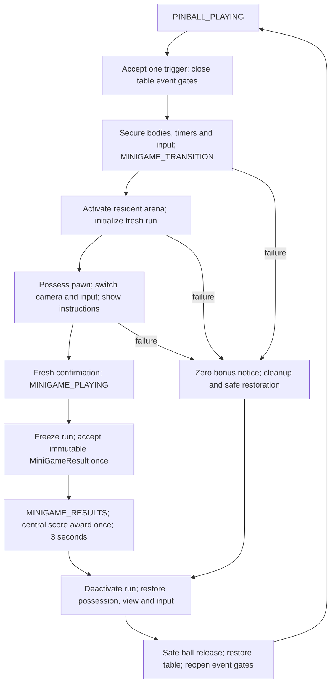

# Implementation Plan: Alien Invasion Pinball MVP

**Branch**: `main` | **Date**: 2026-09-15 | **Spec**: [spec.md](spec.md)

**Input**: `specs/001-alien-pinball-mvp/spec.md` and the eleven requested milestones.
The setup resolver returned feature identifier `001-alien-pinball-mvp` as BRANCH; actual Git
branch inspection returned `main`. No branch switch is performed by this planning workflow.

## Summary

Build one complete three-ball cabinet with three 30-second arcade minigames using a pragmatic
C++/Blueprint architecture. Keep the pinball world alive throughout every minigame. Separately
authored, preloaded streamed arena levels provide content isolation; an explicit transition
transaction secures the table, activates a run, swaps pawn/camera/input, awards one result,
and restores the table. Do not use map travel or world pause to enter a minigame.

Define shared data and contracts before writing individual games. Deliver a playable physics
prototype at M2, a complete basic pinball loop at M4, and a stub minigame round trip at M5.
M6–M8 each deliver an independently playable real minigame through the same contract. M9
hardens full-cabinet integration rather than postponing the first transition until late.

## Technical Context

**Language/Version**: Unreal Engine 5.8.2 (locally verified), C++20, Blueprint subclasses.
**Primary Dependencies**: Engine/Core/CoreUObject, InputCore, EnhancedInput, UMG/Slate,
PhysicsCore/Chaos through engine components, Niagara; FunctionalTesting and Automation in
development builds. Stock Asset Manager/StreamableManager for referenced content.
**Storage**: Versioned source, config, Data Assets, maps and Blueprint assets; session-only
in-memory state. No database, accounts or save system.
**Testing**: C++ Automation invariants, AFunctionalTest maps, standalone/package smoke tests,
Unreal Insights frame captures and five-person playtest. No tests have been run yet.
**Target Platform**: Windows x64, keyboard/mouse; development toolchain and reference machine
specified in [research](research.md).
**Project Type**: Offline single-player 3D desktop game, one runtime module.
**Performance Goals**: SC-008: average >=60 FPS, 99% active-play frames <=20 ms, no transition
freeze >250 ms; 1080p reference settings, packaged build. A deliberate instructions/results
screen is not a freeze; input/rendering must remain responsive.
**Constraints**: No paid required assets, original presentation, three-ball accounting,
no simultaneous minigame runs, robust rollback and stale-callback rejection, no theme
references in shared pinball code, no dependencies between specific minigames.
**Scale/Scope**: One table, one ball, two flippers, >=3 bumpers, >=4 targets, >=2 lanes/ramps,
three objective zones, three independently authored arena maps and one local controller.

## Constitution Check

Pre-research gate: PASS. The feature fits the constitution; no exemption is requested.
Post-design gate: PASS against the following concrete design evidence.

| Principle / constraint | Design evidence | Gate |
| --- | --- | --- |
| Theme-independent reuse | Core/Pinball code never imports AlienInvasion or specific minigames; definitions reference content assets | PASS |
| Hybrid architecture / composition | C++ contracts and rules; Blueprint table/layout/tuning/presentation; components and one world subsystem | PASS |
| Arcade physics | Chaos bodies/constraints, tuning before art, no custom solver | PASS |
| Explicit flow and safe continuity | Single flow writer; full transaction, failure and pause protocol; Enhanced Input | PASS |
| Independent minigames | Shared lifecycle and result contract; separate folders and asset references | PASS |
| Central score | Scoring component owns total and award ledger; widgets subscribe | PASS |
| Scope / originality | One original no-paid-assets cabinet; all excluded features remain excluded | PASS |
| Validation / performance | M2 physics gate, M5 transition gate, M9 repeated runs, M11 packaged acceptance | PASS |
| Avoid speculative architecture | One module, native GameInstance/PlayerCameraManager, no generic service locator or manager base | PASS |

Planning creates only design documents. Project creation, assets, source, build and test
execution occur in later implementation. No template, constitution or feature requirement
change is needed for this design.

## Project Structure

### Documentation (this feature)

```text
specs/001-alien-pinball-mvp/
  spec.md
  plan.md
  research.md
  data-model.md
  contracts/
    gameplay.md
    transitions.md
  quickstart.md
  checklists/requirements.md
  tasks.md                       # future speckit-tasks output; not created here
```

### Source Code (repository root)

Proposed layout, not files created by this plan:

```text
PinballBattle.uproject
Config/                          # default maps, input, collision, physics, packaging
Source/
  PinballBattle.Target.cs
  PinballBattleEditor.Target.cs
  PinballBattle/
    PinballBattle.Build.cs
    Public/                      # and matching Private/ folders
      Framework/                 # GameMode, GameState, controller, flow, score
      Pinball/                   # ball/table/actuators/interaction components
      Minigames/Shared/           # lifecycle interface, base runtime, world subsystem
      Minigames/AsteroidField/
      Minigames/PlanetaryDefense/
      Minigames/AlienAssault/
      Data/                      # reflected structs/enums and definition Data Assets
      UI/                        # small UUserWidget presentation base
    Private/Tests/               # development-only Automation coverage
Content/
  Framework/{Input,UI,Pinball,Minigames}/
  Cabinets/AlienInvasion/{Blueprints,Data,Maps,Art,Audio,FX}/
  Minigames/AsteroidField/{Blueprints,Data,Maps,Art,Audio}/
  Minigames/PlanetaryDefense/{Blueprints,Data,Maps,Art,Audio}/
  Minigames/AlienAssault/{Blueprints,Data,Maps,Art,Audio}/
  Tests/{Maps,Blueprints}/        # excluded from shipping cook
```

**Structure Decision**: One runtime module avoids premature plugin/module overhead. Shared
headers may depend only on engine and shared types; per-game code may depend on Shared, never
on sibling games. The cabinet exists in assets. Add a module boundary only when a real reuse
or packaging requirement warrants it. Use asset references and stable data IDs, never Actor
names, string-based world searches, or Level Blueprint ownership of rules. Configure Git LFS
for binary .uasset/.umap files when M1 introduces content; do not track generated folders.

## Framework Responsibilities

| Unreal concept | Planned class / asset | Responsibility and explicit boundary |
| --- | --- | --- |
| GameModeBase | APinballGameModeBase; BP_PinballGameMode | Bootstrap cabinet, validate table registration, new session/restart, ball lifecycle; owns flow component. No minigame-specific rules or UI |
| GameStateBase | APinballGameStateBase | Read-only session projection: IDs, ball count, flow/resume state, objectives and latest award; owns scoring component. No UI logic or second score total |
| Actor Component: flow | UGameFlowComponent on GameMode | Sole legal flow-state writer and transaction initiator; gates events, delegates environment work; publishes state through GameState |
| Actor Component: scoring | UPinballScoringComponent on GameState | Sole mutable int64 total, scoring profiles, event/run ledger, multiplier validation and OnScoreChanged/OnBonusAwarded |
| PlayerController | APinballPlayerController; BP_PinballPlayerController | Local input, mode latches, possession, explicit view targets using built-in PlayerCameraManager, cursor/focus, widget lifetime |
| Pinball pawn | APinballControlPawn; BP_PinballControlPawn | Stable persistent possession target; forwards flipper/plunger commands to registered table. Ball is not possessed |
| Physical Actors | APinballBall, APinballFlipper, APinballPlunger, APinballTable | Chaos body and actuator behavior; table root owns references/registration, spawn and safe-return transforms |
| Composable table behavior | UTableSessionComponent, UScoringTargetComponent, UMinigameTriggerComponent, UDrainComponent, ULaneProgressComponent, UBumperResponseComponent | Suspension registry/timer ownership; contact event identities; objective requests, drain requests, lane sequence, bumper impulse. No score UI writes |
| World subsystem | UMinigameWorldSubsystem | Residency, root registration, active run record, load/readiness/cancel generation, cleanup. Does not write global flow or score |
| Minigame Actor/Pawn | AMiniGameRuntimeBase plus three runtime subclasses; independent pawn subclasses | Shared lifecycle guard and local clock; each runtime owns only its own rules, actors and result |
| GameInstance / subsystem | Stock UGameInstance; no custom GameInstanceSubsystem | Application lifetime is unnecessary for session data. UGameUserSettings handles video settings; session is world-scoped |
| Enhanced Input | Existing UEnhancedInputLocalPlayerSubsystem | Common context plus one mode context. Controller owns changes; game definitions supply mappings |
| Data Assets | UCabinetDefinition, UMiniGameDefinition, UScoringProfile, UPinballTuningData (UPrimaryDataAsset) | Content references, environment definitions, reward weights, physics/control tuning; editable configuration, no live session state |
| UI | UPinballPresentationWidget base; WBP_Start, WBP_PinballHUD, WBP_MinigameHUD, WBP_Instructions, WBP_Results, WBP_Pause, WBP_GameOver | Bind/unbind state/run delegates; emit player intents. No authoritative timers, score conversion or transitions |

Actor components are justified by reusable behavior on existing Actors. Do not introduce
separate ScoreManager, CameraManager Actor, InputManager, CabinetManager or custom timer
service. Use engine timers with explicit ownership and native view/input APIs.

## Environment and Transition Design

Selected approach: persistent `L_AlienCabinet`, with `L_MG_AsteroidField`,
`L_MG_PlanetaryDefense`, and `L_MG_AlienAssault` as non-World-Partition streamed instances.
Definitions provide soft world references, runtime class and arena bounds; the cabinet provides
three non-overlapping arena slot transforms. A root of the expected class registers against
its actual streaming-instance handle, not a map/Actor name. Stream roots cannot start on
BeginPlay. Preload and register at BOOT; Start is available once all shipping definitions are
ready. Keep levels added/shown but explicitly hide/deactivate dormant environment components.

Only one run is active. Table physics is suspended while the selected arena is active. The
persistent world, GameMode, GameState, table Actors and PlayerController remain the same.
Minigame levels cannot override world gravity, GameMode, time dilation, or global post-process.
Use local-plane arcade motion in arenas; the pinball continues to use 3D Chaos physics.



The detailed normative sequence, gates, pause behavior, timeout/rollback and acceptance tests
are in [contracts/transitions.md](contracts/transitions.md). Those guarantees are implemented
at M5 and hardened at M9. Never equate hidden with frozen, level loaded with ready, or context
added with safe input.

## Contracts Before Individual Games

M1 declares the types; M4 implements score/flow; M5 proves the shared contract with a stub.
M6–M8 cannot create alternate contracts.

- [data-model.md](data-model.md): flow, session/ball/run IDs, table/body snapshots, definitions,
  context/result/award records, validation and lifetime.
- [contracts/gameplay.md](contracts/gameplay.md): IMiniGameLifecycle, table suspension, input,
  scoring endpoints/events, reward formula and concrete low/high examples.
- [contracts/transitions.md](contracts/transitions.md): ordered transaction and race/failure rules.

Use reflected C++ structs/enums and BlueprintNativeEvent seams for content hooks. The runtime
base enforces lifecycle state and publishes result delegates; Blueprints cannot bypass
exactly-once guards. Minigame contexts do not contain a scoring service or mutable session.

## Iterative Milestones

Every milestone below identifies new or extended types. A name listed as reused requires no
new wrapper class. Earlier deliverables remain runnable throughout later milestones.

### M1 — Project Foundation and Architecture

- **C++**: APinballGameModeBase, APinballGameStateBase, APinballPlayerController,
  APinballControlPawn, UGameFlowComponent, UPinballScoringComponent, UMinigameWorldSubsystem
  minimal shells; shared enums/struct declarations, IMiniGameLifecycle,
  ITableSuspendParticipant, and four definition Data Asset classes. Do not implement three
  games here. World subsystem filters out editor preview worlds and clears state at teardown.
- **Blueprints/assets**: BP_PinballGameMode, BP_PinballPlayerController, BP_PinballControlPawn,
  WBP_Start, WBP_Pause; L_AlienCabinet graybox shell, DA_AlienCabinet, IMC_Common and IMC_Pinball.
- **Unreal systems**: UnrealBuildTool, Game Framework, Enhanced Input, UMG, Data Asset validation,
  collision channels, default maps and asset cook references. Prepare binary version control.
- **Dependencies**: Research and contracts in this plan; engine/toolchain verification.
- **Test/acceptance**: Editor and standalone development launch; start/attract and pause UI;
  valid defaults, data ID validation and all declared types compile. No theme imports in
  shared folders. Capture baseline build command and toolchain version.
- **End result**: A launchable, testable cabinet shell with controls/menu scaffolding; no ball
  gameplay is claimed yet. Covers the infrastructure for FR-001, FR-014, FR-029–030.

### M2 — Pinball Physics Prototype

- **C++**: APinballBall sphere physics root; APinballFlipper with constrained body and angular
  drive; APinballPlunger with bounded charge/release impulse; APinballTable and initial
  UTableSessionComponent registry; FBodySnapshot/FPinballTuning use.
- **Blueprints/assets**: BP_PinballBall, BP_Flipper, BP_Plunger, BP_PrototypeTable;
  L_PhysicsPrototype, DA_PinballTuning, physical materials and simple walls.
- **Unreal systems**: Chaos, UPhysicsConstraintComponent, sphere/simple mesh collision, CCD,
  substepping, Enhanced Input and a fixed camera Actor.
- **Dependencies**: M1.
- **Test/acceptance**: Short/full-charge launches, two independently responsive flippers;
  20 launches/100 contacts, 30/60/120 FPS comparison, velocity and tunneling observation.
  Test suspend/resume of a moving ball and constrained flippers in isolation. Tune table scale,
  incline, mass, impulse, friction/restitution and limits before progressing.
- **End result**: A fun-to-test graybox launch-and-flip table, manually resettable for repeated
  tests. FR-003–005 and SC-003 foundations; scoring and three-ball sessions are not complete.

### M3 — Complete Basic Pinball Gameplay

- **C++**: UScoringTargetComponent, UBumperResponseComponent, ULaneProgressComponent,
  UDrainComponent, UMinigameTriggerComponent; APinballTable spawn/recovery routines and
  UTableSessionComponent ownership; FScoringEvent and FBallHandle production.
- **Blueprints/assets**: BP_Bumper, BP_ScoringTarget, BP_Lane, BP_MinigameObjective, BP_Drain,
  BP_AlienTable graybox with >=3 bumpers, >=4 targets, >=2 lanes/ramps and three objectives.
- **Unreal systems**: Overlap/hit callbacks, collision filters, gameplay timer handles, debug
  display, simple audio/flash feedback; Functional Test prototype map.
- **Dependencies**: M2.
- **Test/acceptance**: All objects reachable with ball play; bumper rebound; ordered lane
  traversal; one event per contact episode; drain/spawn and 10-second trap recovery work.
  Objectives emit typed requests but need not start a minigame yet.
- **End result**: Complete physical table playable in a repeat-ball practice loop with visible
  event counters. Shipping three-ball accounting is implemented next. FR-002, FR-004, FR-007.

### M4 — Scoring and Game Flow

- **C++**: Complete UGameFlowComponent, UPinballScoringComponent, APinballGameStateBase;
  GameMode new game/drain/restart; FSessionState, FScoreAward, lifecycle/event identity gates;
  controller pause and UPinballPresentationWidget subscriptions.
- **Blueprints/assets**: WBP_PinballHUD, WBP_GameOver, completed WBP_Start/WBP_Pause;
  DA_AlienScoring, target/bumper/lane feedback bindings, scoring profile defaults.
- **Unreal systems**: Delegates, UMG, Enhanced Input common/gameplay contexts, native pause,
  Automation for score arithmetic and state edges.
- **Dependencies**: M3.
- **Test/acceptance**: 100+50+500=650 and multiplier-two=1300; repeated contacts/late events
  rejected; 3→2→1→0 drain accounting, pause, final score lock, clean restart and Quit.
- **End result**: A complete three-ball pinball game with score/HUD/game over, playable without
  minigames. FR-001, FR-006, FR-015, FR-022–028; SC-001–002 baseline.

### M5 — Generic Minigame Framework

- **C++**: AMiniGameRuntimeBase, IMiniGameLifecycle implementation guard;
  UMinigameWorldSubsystem residency/run handling; ITableSuspendParticipant and full
  UTableSessionComponent snapshots; FTransitionRecord, FMiniGameContext/Result;
  controller presentation/input capture/restore and flow transition integration.
- **Blueprints/assets**: BP_MG_TestRuntime and BP_MG_TestPawn (test-only simple Space action),
  L_MG_Test, L_TransitionTest, DA_MG_Test, IMC_MG_Test, WBP_Instructions/WBP_MinigameHUD/
  WBP_Results. Production UI remains reusable; stub assets excluded from shipping.
- **Unreal systems**: ULevelStreamingDynamic, Asset Manager async loading, subsystem lifecycle,
  pawn possession, camera view targets, Enhanced Input rebuilds, owned timers and UMG.
- **Dependencies**: M4; shared contracts must be reviewed before per-game implementation.
- **Test/acceptance**: Real pinball trigger→stub→result→same ball works ten times; table body
  transforms/timers stable during run; bonus once; no stale key action. Pause in every phase;
  inject missing level/root/camera, duplicate finish, drain race and stale callback after reset.
- **End result**: Playable pinball interrupted by a tiny test minigame and safely resumed.
  FR-008–015 and FR-023–024 proven without depending on any real minigame.

### M6 — Asteroid-Field Minigame

- **C++**: AAsteroidFieldRuntime : AMiniGameRuntimeBase, AAsteroidShipPawn,
  AAsteroidObstacle and AAsteroidProjectile; local motion, hit identity and lives rules.
  Reuse all shared contracts and scoring profile interpretation.
- **Blueprints/assets**: BP_AsteroidFieldRuntime, BP_AsteroidShip, BP_AsteroidObstacle,
  BP_AsteroidProjectile, L_MG_AsteroidField, DA_MG_AsteroidField, IMC_AsteroidField;
  original simple ship/rocks and HUD styling.
- **Unreal systems**: Pawn input, planar movement with swept collision/reflection, projectile
  movement, timers, camera, streamed root registration and local effects. No custom rigid-body
  solver; arcade trajectory movement is bounded gameplay logic.
- **Dependencies**: M5; independent of M7/M8.
- **Test/acceptance**: Rotate/thrust/fire, visible boundary rebounds, one award per destroyed
  object, three lives, protected respawn, timeout or final-life finish; reward examples pass.
- **End result**: Asteroid Field playable alone in a harness and from its graybox table target,
  returning through the production transition path. FR-016–017. Splitting objects deferred.

### M7 — Planetary-Defense Minigame

- **C++**: APlanetaryDefenseRuntime, ADefenseAimPawn, ADefenseThreat,
  ADefenseInterceptor, ADefenseBlastZone, ADefenseColony; independent threat/colony rules.
- **Blueprints/assets**: Corresponding BP_Defense* descendants, BP_PlanetaryDefenseRuntime,
  L_MG_PlanetaryDefense, DA_MG_PlanetaryDefense, IMC_PlanetaryDefense.
- **Unreal systems**: Mouse deprojection onto arena plane, clamped aim, swept projectile
  movement, overlap zones, timers, shared lifecycle/HUD and streamed level root.
- **Dependencies**: M5; M6 supplies regression coverage but is not a code dependency.
- **Test/acceptance**: Three colonies, unlimited launch ammunition with configured fire-rate
  limit, blast lifetime, overlapping blasts never count a threat twice; all-colonies-lost
  still runs to 30 seconds. Destruction and surviving colonies both affect the reward.
- **End result**: Independently playable defense and a second cabinet round trip.
  FR-018–019; same immutable result and scoring path.

### M8 — Alien-Assault Minigame

- **C++**: AAlienAssaultRuntime, AAssaultShipPawn, AAssaultEnemy,
  AAssaultProjectile; formation/wave logic stays in this runtime, no cross-game base hierarchy.
- **Blueprints/assets**: BP_AlienAssaultRuntime, BP_AssaultShip/Enemy/Projectile,
  L_MG_AlienAssault, DA_MG_AlienAssault, IMC_AlienAssault and original alien visuals.
- **Unreal systems**: Planar Pawn movement, bounded enemy motion, projectile collision,
  fire timers, shared lifecycle, camera and UI.
- **Dependencies**: M5; M6/M7 are regression scenarios, not imports.
- **Test/acceptance**: Horizontal movement/fire, moving firing enemies, three lives and
  protected respawn; timeout/final-life finish; destruction and survival scoring examples.
- **End result**: Third independently playable minigame and cabinet round trip. FR-020–021.

### M9 — Pinball/Minigame Integration

- **C++**: Harden existing GameMode/flow/scoring/subsystem/table/controller; no new manager.
  Add development-only APinballTransitionFunctionalTest : AFunctionalTest and test helpers.
- **Blueprints/assets**: Final DA_AlienCabinet associations and safe release markers,
  BP_AlienTable trigger configuration, L_TransitionTest and three-game regression fixtures.
- **Unreal systems**: Cooked soft references/Asset Manager inclusion, streaming readiness,
  callback cancellation generations, profile captures, functional tests.
- **Dependencies**: M6, M7, M8 and all M5 invariants.
- **Test/acceptance**: All three reachable in one three-ball session; ten round trips per game;
  test every failure/pause/input/result race in contracts/transitions.md. Restart invalidates
  in-flight requests. Test cooked build, not only Editor references. No stale actors or timers
  after repeated cycles; no score/drain leakage. Re-arm needs exit/re-entry plus one second.
- **End result**: Feature-complete graybox MVP with all three minigames integrated.
  SC-004–007 and FR-007–015, FR-030 complete behavior gate.

### M10 — Alien Cabinet Presentation

- **C++**: Reuse existing delegate/widget/data hooks; no new gameplay classes unless a concrete
  presentation binding needs a small extension to UPinballPresentationWidget.
- **Blueprints/assets**: BP_AlienTable final layout dressing, WBP_* themed descendants,
  UFO/radar/rocket objectives, emissive materials, original/simple meshes, audio and Niagara.
- **Unreal systems**: Materials, lighting, Niagara, audio attenuation/concurrency, UMG and
  camera composition. Keep effects arena-local; static table collision stays simple.
- **Dependencies**: M9 (placeholder presentation already exists in all previous milestones).
- **Test/acceptance**: Names plus distinct visuals identify objectives; HUD/ball readable;
  no new collision obstruction or global minigame light/audio bleed. Review asset provenance
  and no required paid assets; physics and round-trip regressions still pass.
- **End result**: Fully themed polished-prototype cabinet. FR-005, FR-025–026, FR-029.

### M11 — Feedback, Tuning and Polish

- **C++**: Tune/fix existing systems from measurements; complete Automation and functional
  regression coverage. No new speculative systems or per-game score managers.
- **Blueprints/assets**: Final feedback curves, audio, scoring/physics/difficulty Data Assets,
  instruction wording, safe return settings and camera/HUD polish.
- **Unreal systems**: Unreal Insights, stat unit/physics, packaged Win64 builds, scalability,
  PSO/shader warmup as required by measured hitches, Automation reports.
- **Dependencies**: M10 and stable M9 behavior.
- **Test/acceptance**: Run all SC-001–010, including five-person usability study and reference
  hardware frame pacing. Low/high bonus examples remain attainable; transitions stay below
  freeze limit. Review shared dependency boundaries and all 17 user acceptance criteria.
- **End result**: Release-candidate first playable MVP with recorded results and any remaining
  defects disclosed. No completion claim until these checks actually pass.

## Validation and Risk Gates

| Risk | Earliest proof / required response |
| --- | --- |
| Flipper tunneling or poor feel | M2 physics lab across frame rates; adjust geometry/Chaos tuning before art |
| Hidden table still scores/drains | M5 snapshot/event assertions and queued-callback injection |
| Loading or shader hitch | Boot async preload, bounded assets; M9 cooked cold/warm run and M11 frame capture |
| Input bleed from shared arrows/Space | M5 held-key tests both directions and pause, Boolean plus axis gating |
| Duplicate result/restart callback | Session/run/generation checks, terminal latch and score ledger tested at M5 |
| Dormant arena still ticks/emits sound | Explicit actor/timer/component ownership, zero-active-run counters at M9 |
| Content accidentally couples games | Per-game harness plus include/asset-reference review at M6–M9 |
| Unreal/SDK mismatch | M1 clean compile using installed engine-supported SDK; no source build workaround |

Validation commands and expected evidence are in [quickstart.md](quickstart.md). Exact class
names here are planned project types, not pre-existing engine APIs. Shared contract changes
must update all three implementations and their tests in the same change; no silent
per-minigame forks. Planning is complete; `speckit-tasks` will turn milestones into executable
work items without changing their acceptance gates.

## Complexity Tracking

No constitutional violations or exemptions. One world subsystem and component-owned services
fit required lifetimes. Preloading three small arenas is a deliberate memory/latency tradeoff,
measured in M9/M11, not a general streaming framework.
