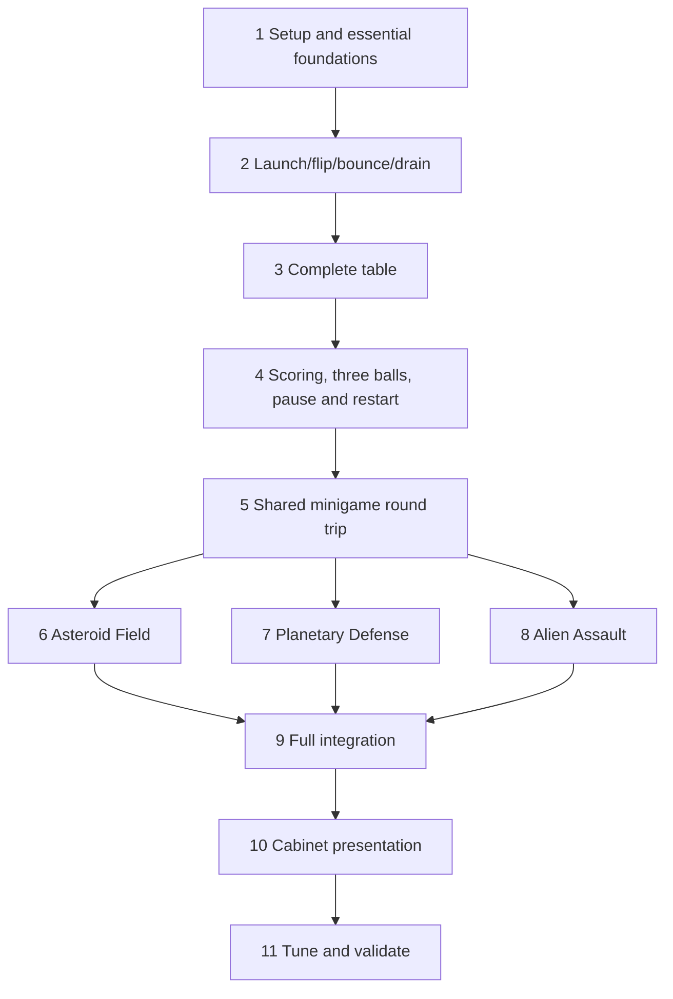

# Tasks: Alien Invasion Pinball MVP

**Input**: [spec.md](spec.md), [plan.md](plan.md), [research.md](research.md),
[data-model.md](data-model.md), [gameplay contract](contracts/gameplay.md),
[transition contract](contracts/transitions.md), [quickstart.md](quickstart.md), and
[constitution](../../.specify/memory/constitution.md).

**Organization**: Eleven milestone phases with story-specific task groups. The user's latest
instruction overrides an architecture-only foundational phase: essential foundations belong
to Phase 1; **Phase 2 must deliver playable launch–flip–bounce–drain–reset pinball**. Drain/reset
moves forward from plan M3. Score and minigame infrastructure arrive only when needed. All
final MVP requirements remain mandatory. A story can span multiple playable increments.

**Tests**: The constitution requires meaningful score/flow/lifecycle automation and the spec
requires playable acceptance. Include those checks without imposing blanket TDD. Record actual
results at each checkpoint; compilation alone does not prove gameplay. Completion is tracked by the task checkboxes below.

## Format: `[ID] [P?] [Story] Description`

- Tasks use sequential IDs, unchecked boxes, story labels and repository-relative file paths.
- `[P]` means independent files after the stated prerequisites, not unconditional parallelism.
- A `.cpp` task also creates/updates its matching declaration under `Public/` with the same
  relative folder/name and `.h` extension. Explicit `.h` tasks establish shared contracts.
- Serialize edits to shared controller/flow files and the same Unreal binary asset/map.
- Asset paths mean real Unreal assets, never text files renamed to .uasset/.umap.
- Evidence summaries go in the named Markdown paths; bulky reports/traces stay in `Saved/`.

## Path Conventions

Module: `Source/PinballBattle/`; assets: `Content/`; configuration: `Config/`.
Feature documents: `specs/001-alien-pinball-mvp/`. `/Game/` references map to `Content/`.
Use stock GameInstance and PlayerCameraManager; no extra custom manager hierarchy.

## Phase 1: Setup and Essential Foundations — Plan M1

**Goal**: A clean-building launchable project with only foundations needed for first play.
**Dependencies**: None. **Independent test**: Build/open the project, launch the empty map,
and verify controller/pawn/input assets. No ball gameplay is claimed at this checkpoint.

- [X] T001 Verify UE 5.8.2 and supported compiler/SDK from research.md; record installed versions and build command in specs/001-alien-pinball-mvp/validation/setup.md.
- [X] T002 Create PinballBattle.uproject, Source/PinballBattle.Target.cs, Source/PinballBattleEditor.Target.cs and Source/PinballBattle/PinballBattle.Build.cs for the blank Windows C++20 project; preserve repository documents and enable Enhanced Input, UMG, PhysicsCore and Niagara.
- [X] T003 Configure binary tracking in .gitattributes and confirm generated-file exclusions in .gitignore; verify Git LFS before adding binary content and record prerequisites in specs/001-alien-pinball-mvp/validation/setup.md.
- [X] T004 Create minimal GameModeBase, GameStateBase and PlayerController classes in Source/PinballBattle/Private/Framework/PinballGameModeBase.cpp, PinballGameStateBase.cpp and PinballPlayerController.cpp in that directory, plus Source/PinballBattle/Private/Pinball/PinballControlPawn.cpp; establish explicit references, without score/minigame implementation.
- [X] T005 Define flow enum in Source/PinballBattle/Public/Data/PinballSessionTypes.h and sole state-writer component in Source/PinballBattle/Private/Framework/GameFlowComponent.cpp; include "BOOT, ATTRACT, PINBALL_READY, PINBALL_PLAYING, MINIGAME_TRANSITION, MINIGAME_PLAYING, MINIGAME_RESULTS, BALL_LOST, GAME_OVER, PAUSED".
- [X] T006 Author Content/Framework/Blueprints/BP_PinballGameMode.uasset, BP_PinballPlayerController.uasset in that directory, Content/Framework/Pinball/BP_PinballControlPawn.uasset and Content/Tests/Maps/L_PhysicsPrototype.umap; configure classes/map and collision channels in Config/DefaultEngine.ini.
- [X] T007 Author Content/Framework/Input/IA_LeftFlipper.uasset, IA_RightFlipper.uasset, IA_Plunger.uasset, IA_Pause.uasset, IMC_Pinball.uasset and IMC_Common.uasset in that directory; configure Enhanced Input in Config/DefaultInput.ini for Left/Right, hold/release Down, and Escape.
- [X] T008 Build Development Editor and launch the empty prototype standalone; record startup, correct classes and loaded inputs in specs/001-alien-pinball-mvp/validation/setup.md.

**Checkpoint**: Setup complete; no separate nonplayable foundational phase follows.

## Phase 2: First Playable Pinball — US1 (P1), Plan M2 + Early Drain/Reset

**Goal**: Launch a ball, operate both flippers, bounce off walls/bumpers, drain and launch again.
**Dependencies**: Phase 1 only. **Independent test**: Five complete launch–flip–bounce–drain–
reset cycles without editor intervention, including short/full charge and both flippers.
**Scope**: Repeat-ball practice mode. No score, three-ball limit, minigames or final art yet.
Practice configuration lives in test content, not a second manager or shipping rules fork.

### Implementation for User Story 1 — First Playable Slice

- [X] T009 [US1] Define UPinballTuningData in Source/PinballBattle/Private/Data/PinballTuningData.cpp with table scale/incline, ball size/mass/speed, charge/impulse and flipper drive values; validate positive finite physical values and retain "10-second trap window; exempt launch/capture areas" for recovery.
- [X] T010 [US1] Implement APinballTable and initial UTableSessionComponent in Source/PinballBattle/Private/Pinball/PinballTable.cpp and TableSessionComponent.cpp in that directory; own exactly one ball and explicit actuator/camera/spawn references, never Actor-name searches.
- [X] T011 [P] [US1] Implement Chaos sphere-root APinballBall with CCD, materials and bounded speed in Source/PinballBattle/Private/Pinball/PinballBall.cpp (after T009–T010).
- [X] T012 [P] [US1] Implement APinballFlipper with one constrained hinge, Twist/Swing drive, held/neutral positions and configurable torque/damping in Source/PinballBattle/Private/Pinball/PinballFlipper.cpp (after T009–T010; independent of T011).
- [X] T013 [US1] Implement bounded plunger charge/release and CancelActions that never fires on cancellation in Source/PinballBattle/Private/Pinball/PinballPlunger.cpp; distinguish short/full launch (after T011).
- [X] T014 [US1] Wire controller/pawn Left/Right/Down forwarding and fixed camera selection in Source/PinballBattle/Private/Framework/PinballPlayerController.cpp and Source/PinballBattle/Private/Pinball/PinballControlPawn.cpp; gate launch to ready state.
- [X] T015 [US1] Implement bounded bumper rebound and once-per-ball drain reporting in Source/PinballBattle/Private/Pinball/BumperResponseComponent.cpp and DrainComponent.cpp in that directory, without scoring dependencies.
- [X] T016 [US1] Add practice lifecycle to Source/PinballBattle/Private/Framework/PinballGameModeBase.cpp and GameFlowComponent.cpp in that directory: spawn ready ball, launch, accept drain once, remove old ball and spawn exactly one replacement; configure practice only for the test map.
- [X] T017 [US1] Author Content/Framework/Pinball/BP_PinballBall.uasset, BP_Flipper.uasset, BP_Plunger.uasset, BP_Bumper.uasset, BP_Drain.uasset, DA_PinballTuning.uasset and PM_Pinball.uasset in that directory from the reusable actors/components.
- [X] T018 [US1] Construct Content/Tests/Blueprints/BP_PrototypeTable.uasset and Content/Tests/Maps/L_PhysicsPrototype.umap with inclined playfield, plunger lane, two flippers, rebound obstacles/walls, >=3 bumpers, one drain, spawn and camera; add Content/Tests/Blueprints/WBP_PrototypeControls.uasset instructions.
- [X] T019 [US1] Tune Config/DefaultEngine.ini and Content/Framework/Pinball/DA_PinballTuning.uasset for simple thick collision, CCD and initial substeps (1/120 second, maximum eight); verify useful launch/flipper return and no unavoidable immediate drain.
- [X] T020 [US1] Perform five full practice cycles, 20 short/full launches and 100 observed contacts, comparing 30/60/120 FPS; fix blocking play/reset defects and record controls, launch command and evidence in specs/001-alien-pinball-mvp/validation/first-playable.md.

**Checkpoint / first delivery**: Launch–flip–bounce–drain is playable repeatedly. Do not replace
this acceptance gate with more architecture work.

## Phase 3: Complete Table Interactions — US1 (P1), Plan M3

**Goal**: All required physical elements and reliable typed events.
**Dependencies**: Phase 2. **Independent test**: Reach every target/lane, emit one event per
hit/traversal, drain/reset, and force trap/escape recovery without duplicate balls.

- [X] T021 [US1] Extend Source/PinballBattle/Public/Data/PinballSessionTypes.h with FBallHandle and define FScoringEvent/FScoreAward in Source/PinballBattle/Public/Data/ScoringTypes.h; preserve "New spawned entitlement gets a new ID; recover/return preserves ID" and "Event carries a category, not an arbitrary UI delta".
- [X] T022 [P] [US1] Implement contact-episode deduplication and separation re-arm in Source/PinballBattle/Private/Pinball/ScoringTargetComponent.cpp; one typed event per genuine hit, not per substep (after T021).
- [X] T023 [P] [US1] Implement ordered entry→exit lane completion and departure re-arm in Source/PinballBattle/Private/Pinball/LaneProgressComponent.cpp; reject incomplete/reverse traversal (after T021; independent of T022).
- [X] T024 [US1] Add ball/event identities and score contact episodes to Source/PinballBattle/Private/Pinball/BumperResponseComponent.cpp and DrainComponent.cpp in that directory; physical cooldown is not repeated long-contact scoring.
- [X] T025 [US1] Implement escape bounds and "10-second trap window; exempt launch/capture areas" in Source/PinballBattle/Private/Pinball/PinballTable.cpp; collision-check fallback release and preserve ball entitlement without award/decrement.
- [X] T026 [US1] Author Content/Framework/Pinball/BP_ScoringTarget.uasset and BP_Lane.uasset; populate Content/Cabinets/AlienInvasion/Blueprints/BP_AlienTable.uasset and Content/Cabinets/AlienInvasion/Maps/L_AlienCabinet.umap with >=4 targets, >=2 lanes/ramps, >=3 bumpers, drain, special-objective placeholders and primary/backup return markers.
- [X] T027 [US1] Add visible flashes and placeholder/original sounds to Content/Framework/Pinball/BP_ScoringTarget.uasset, BP_Bumper.uasset and BP_Lane.uasset; feedback must not mutate score UI.
- [X] T028 [US1] Validate table reachability, distinct events and no-penalty trap/escape recovery; record repeat-ball gameplay in specs/001-alien-pinball-mvp/validation/table-interactions.md.

**Checkpoint**: Complete graybox table remains playable; typed producers are ready for scoring.

## Phase 4: Three-Ball Game, Pause and Restart — P1 Stories, Plan M4

**Goal**: Complete scored sessions with pause, final score, Restart and Quit.
**Dependencies**: Phase 3. **Independent tests**: US1 score hits/drain three balls; US6 pause a
moving ball three times; US7 restart twice from game over, then Quit.

### User Story 1 — Scoring and Session Completion

- [X] T029 [US1] Complete FSessionState and GameState projection in Source/PinballBattle/Public/Data/PinballSessionTypes.h and Source/PinballBattle/Private/Framework/PinballGameStateBase.cpp; enforce "BallsRemaining (0..3)", "Multiplier (positive bounded integer, default 1)" and "Only GameMode/flow mutate session fields".
- [X] T030 [US1] Define UScoringProfile and scoring API in Source/PinballBattle/Public/Data/ScoringProfile.h and Source/PinballBattle/Public/Framework/PinballScoringComponent.h; preserve "TotalScore (int64 >=0)", "Allowed session multiplier range 1..10" and "floor once after multiplication; int64 checked arithmetic with overflow rejection".
- [X] T031 [US1] Add score scenarios in Source/PinballBattle/Private/Tests/PinballScoreTests.cpp for 650/1300 examples, duplicate/stale events, invalid data and overflow against T030's API before filling its behavior.
- [X] T032 [US1] Implement Source/PinballBattle/Private/Data/ScoringProfile.cpp and Source/PinballBattle/Private/Framework/PinballScoringComponent.cpp with sole total/event ledger/delegates; enforce "duplicate categories rejected, missing requested profile rejected, finite bounded values only, no negative weights"; configure Target=100/Bumper=50/Lane=500 in Content/Cabinets/AlienInvasion/Data/DA_AlienScoring.uasset.
- [X] T033 [US1] Implement production start/ready/play/lost/game-over edges and 3→2→1→0 accounting in Source/PinballBattle/Private/Framework/GameFlowComponent.cpp and PinballGameModeBase.cpp in that directory; accept drains once and lock final score, keeping test practice mode explicit.
- [X] T034 [US1] Implement Source/PinballBattle/Private/UI/PinballPresentationWidget.cpp, Content/Framework/UI/WBP_Start.uasset and Content/Framework/UI/WBP_PinballHUD.uasset for delegate-bound score/balls and Start intent; widgets own neither score nor gameplay timers.
- [X] T035 [US1] Define Source/PinballBattle/Private/Data/CabinetDefinition.cpp and Content/Cabinets/AlienInvasion/Data/DA_AlienCabinet.uasset with explicit table/pawn/camera/profile/tuning; preserve "Initial balls =3; return trigger protection =1 second; results presentation =3 seconds" and use explicit development configuration until three games exist.
- [X] T036 [US1] Bind events to central scoring, set L_AlienCabinet in Config/DefaultEngine.ini, add Source/PinballBattle/Private/Tests/PinballFlowTests.cpp state/accounting checks, and record session acceptance in specs/001-alien-pinball-mvp/validation/basic-session.md.

### User Story 6 — Pause Pinball

- [X] T037 [US6] Implement native pause and saved-state/input/event gates in Source/PinballBattle/Private/Framework/GameFlowComponent.cpp; enforce "Pause is an overlay with one saved underlying state, never a stack of PAUSED states" and atomic drain acceptance.
- [X] T038 [US6] Wire pause-capable Escape/fresh-input resume in Source/PinballBattle/Private/Framework/PinballPlayerController.cpp and author Content/Framework/UI/WBP_Pause.uasset; freeze movement, scoring and timers while menu remains responsive.
- [X] T039 [US6] Extend Source/PinballBattle/Private/Tests/PinballFlowTests.cpp and perform three moving-ball pause cycles; record unchanged positions/progress and valid resumed controls in specs/001-alien-pinball-mvp/validation/pause.md.

### User Story 7 — Restart or Quit

- [X] T040 [US7] Implement new-session reset and Quit in Source/PinballBattle/Private/Framework/PinballGameModeBase.cpp and PinballPlayerController.cpp in that directory; enforce "New session invalidates every prior run and generation before UI, timers or Actors are reset" and spawn only one fresh ball.
- [X] T041 [US7] Author Content/Framework/UI/WBP_GameOver.uasset with GAME OVER/final score/Restart/Quit; send intents through controller and reject gameplay input after game over.
- [X] T042 [US7] Add Source/PinballBattle/Private/Tests/PinballRestartTests.cpp reset/score-lock cases; perform two restarts and Quit, recording score=0/balls=3/multiplier=1 in specs/001-alien-pinball-mvp/validation/restart.md.

**Checkpoint**: Complete basic pinball is playable; all three minigames remain required later.

## Phase 5: Generic Minigame Round Trip — US2 + US6 (P1), Plan M5

**Goal**: Trigger a stub, safely freeze pinball, play, award once and resume the same ball.
**Dependencies**: Phase 4. **Independent test**: Ten stub round trips, injected failures,
held keys and pause in every phase, without depending on any real minigame.

### User Story 2 — Shared Data and Lifecycle

- [ ] T043 [US2] Define FMiniGameContext/FMiniGameResult and enums in Source/PinballBattle/Public/Data/MiniGameTypes.h; include IDs/generation, success, rating and optional multiplier; retain "Dormant → Initialized → Playing → Ended → Dormant", "TimedOut, LivesExhausted, StartFailed, Cancelled, RuntimeFailed", "RawScore (int64)", "ObjectivesCompleted (int32)", "DurationSeconds (finite double)", "MetricId → finite nonnegative value"; context has "No mutable session or score service pointer".
- [ ] T044 [US2] Implement Source/PinballBattle/Private/Data/MiniGameDefinition.cpp with soft map/runtime/pawn/input/UI references; enforce "Duration =30 active seconds, optional local lives =3", "allowed result-multiplier range (default only 1)", "positive finite dimensions/duration" and "no references to a sibling minigame's classes/content".
- [ ] T045 [US2] Define guarded lifecycle/presentation API in Source/PinballBattle/Public/Minigames/Shared/MiniGameLifecycle.h and MiniGameRuntimeBase.h in that directory: Initialize, presentation readiness, StartMiniGame, EndMiniGame and idempotent Cleanup per contracts/gameplay.md.
- [ ] T046 [US2] Add Source/PinballBattle/Private/Tests/MiniGameLifecycleTests.cpp for partial initialize, repeated start/end/cleanup and result validation; preserve "identity exactly matches active accepted run; one terminal result", "time in 0..duration limit (allow only numerical epsilon, clamp internal clock at limit)", "metrics within definition bounds; raw score >=0; multiplier allowed by definition".
- [ ] T047 [US2] Implement Source/PinballBattle/Private/Minigames/Shared/MiniGameRuntimeBase.cpp with active clock, terminal latch, local progress/result delegates, run-owned actors/timers and guarded Blueprint hooks; no BeginPlay play, invalid results recover at zero bonus, cleanup valid from every stage.
- [ ] T048 [US2] Define FActiveMiniGameRun and implement Source/PinballBattle/Private/Minigames/Shared/MinigameWorldSubsystem.cpp with "at most one active record", per-world registration, streamed-instance identity, explicit run actor cleanup/OverrideLevel and no independent flow/score ownership.
- [ ] T049 [US2] Add asynchronous loaded+shown+registered-root readiness to Source/PinballBattle/Private/Minigames/Shared/MinigameWorldSubsystem.cpp; validate pawn/camera/config, keep cached levels shown but explicitly dormant, isolate effects and enforce 30-second boot deadline/retry; one-stub development configuration must not weaken final production validation.

### User Story 2 — Secure, Switch, Award and Restore

- [ ] T050 [US2] Define FBodySnapshot/FTableSuspendSnapshot/FControllerModeSnapshot/FTransitionRecord in Source/PinballBattle/Public/Data/TransitionTypes.h and ITableSuspendParticipant in Source/PinballBattle/Public/Pinball/TableSuspendParticipant.h; include weak references, "angular velocity in radians", body flags, prior timer states, input/view/focus and generations.
- [ ] T051 [US2] Implement capture/suspend/PrepareRestore/CommitRestore in Source/PinballBattle/Private/Pinball/TableSessionComponent.cpp with participant hooks in PinballBall.cpp, PinballFlipper.cpp, PinballPlunger.cpp, BumperResponseComponent.cpp and LaneProgressComponent.cpp in that directory; freeze registered bodies/drives/ticks/timers and restore only current-generation participants and previously active timers.
- [ ] T052 [US2] Implement Source/PinballBattle/Private/Pinball/MinigameTriggerComponent.cpp and Content/Framework/Pinball/BP_MinigameObjective.uasset with unique objective references, identity-tagged requests and suspended-phase rejection; define FObjectiveState in Source/PinballBattle/Public/Data/PinballSessionTypes.h with availability/completion and re-arm requiring CabinetDefinition.ReturnTriggerProtectionSeconds (MVP one active second, frozen by pause) AND physical exit/re-entry.
- [ ] T053 [US2] Implement acceptance/Securing/Preparing in Source/PinballBattle/Private/Framework/GameFlowComponent.cpp: first accepted trigger/drain wins, close event gates and advance epoch immediately, start five-second watchdog before suspension acknowledgment, mutate physics safely on game thread and reject stale IDs/generations.
- [ ] T054 [US2] Implement mode capture/switch in Source/PinballBattle/Private/Framework/PinballPlayerController.cpp: preserve common mappings, cancel without release-fire, explicit possession/view/cursor/focus, disable auto camera management, ignore held Boolean keys and require axis neutral.
- [ ] T055 [US2] Author Content/Framework/UI/WBP_Instructions.uasset, WBP_MinigameHUD.uasset and WBP_Results.uasset in that directory; display controls/progress/actual awarded bonus and consume fresh Space/Enter confirmation without firing; no authoritative widget clocks/awards.
- [ ] T056 [US2] Implement fresh-confirmation Start and result progression in Source/PinballBattle/Private/Framework/GameFlowComponent.cpp: watchdog ends at technical readiness, human confirmation has no timeout, controls-ready starts active time, accepted result stops play and displays for three unpaused seconds.
- [ ] T057 [US2] Extend Source/PinballBattle/Private/Framework/PinballScoringComponent.cpp and Source/PinballBattle/Private/Data/ScoringProfile.cpp with result validation, finalized-run ledger and pure metric/rating evaluation; enforce "result multiplier range set by definition (MVP 1)", base cap=10,000, multipliers applied once then floor, and zero for failed-start/cancel/runtime failure.
- [ ] T058 [US2] Extend Source/PinballBattle/Private/Tests/PinballScoreTests.cpp for all three contracts/gameplay.md reward profiles, low/high examples, zero finalization, duplicate/stale results, missing/nonfinite metrics, monotonicity and overflow.
- [ ] T059 [US2] Implement ordered return in Source/PinballBattle/Private/Framework/GameFlowComponent.cpp, Source/PinballBattle/Private/Pinball/TableSessionComponent.cpp and Source/PinballBattle/Private/Framework/PinballPlayerController.cpp: release camera/pawn before cleanup, prepare while physics/timers remain frozen, commit state/events/bodies/timers/input atomically only after all acknowledgments. Start the cabinet-configured special-objective rearm delay at commit; ordinary scoring/drains resume immediately and do not share that delay or the separate trap-recovery guard.
- [ ] T060 [US2] Implement idempotent generation-safe recovery in Source/PinballBattle/Private/Minigames/Shared/MinigameWorldSubsystem.cpp and Source/PinballBattle/Private/Framework/GameFlowComponent.cpp: two-active-second notice, zero award, five-second return deadline, safe fallback/same entitlement, and secured Retry/Restart/Quit instead of infinite recovery loops.
- [ ] T061 [US2] Author Content/Framework/UI/WBP_Recovery.uasset and bind controller recovery intents in Source/PinballBattle/Private/Framework/PinballPlayerController.cpp; preserve an already awarded bonus after later cleanup failure and skip restoration during world teardown.

### User Story 6 — Pause Generic Transitions and Runs

- [ ] T062 [US6] Extend Source/PinballBattle/Private/Framework/GameFlowComponent.cpp and PinballPlayerController.cpp in that directory to freeze exact transition/run/result phase, fades/watchdogs/guard clocks and camera presentation; streaming callbacks while paused record readiness only.
- [ ] T063 [US6] Extend Source/PinballBattle/Private/Tests/PinballFlowTests.cpp for one continuation on resume, unchanged clocks, repeated Escape and pause near timeout; record preliminary stub pause acceptance in specs/001-alien-pinball-mvp/validation/pause.md.

### User Story 2 — Playable Framework Proof

- [ ] T064 [US2] Author Content/Tests/Blueprints/BP_MG_TestRuntime.uasset and BP_MG_TestPawn.uasset, Content/Tests/Maps/L_MG_Test.umap, Content/Tests/Data/DA_MG_Test.uasset and Content/Tests/Input/IMC_MG_Test.uasset; tiny Space-action stub uses shipping lifecycle and dormant startup.
- [ ] T065 [US2] Author Content/Tests/Maps/L_TransitionTest.umap and Content/Tests/Data/DA_TransitionTestCabinet.uasset with real table objective, isolated arena and two return markers; add Source/PinballBattle/Private/Tests/PinballTransitionFunctionalTest.cpp and latent Automation wrapper PinballTransitionTests.cpp in that directory.
- [ ] T066 [US2] Run ten stub round trips plus duplicate end, missing root/camera/pawn, start failure, stalled acknowledgment, trigger/drain races, blocked release and stale reset callback; verify no table motion/score/drain leakage and one-second plus exit/re-entry protection in specs/001-alien-pinball-mvp/validation/framework-roundtrip.md.

**Checkpoint**: Pinball → stub → result → same-ball return is playable and pause-safe. Shared
contracts are proven before the individual games are implemented.

## Phase 6: Asteroid Field — US3 (P2), Plan M6

**Goal**: Original bounded-arena shooter. **Dependencies**: Phase 5, not Phases 7/8.
**Independent test**: Timeout and all-lives-lost runs, correct bonus and return with siblings
absent from the test cabinet.

- [ ] T067 [US3] Implement Source/PinballBattle/Private/Minigames/AsteroidField/AsteroidFieldRuntime.cpp with three local lives, owned spawns/damage, common clock/end guard, success at timeout and destruction/result metrics per contracts/gameplay.md.
- [ ] T068 [P] [US3] Implement Source/PinballBattle/Private/Minigames/AsteroidField/AsteroidShipPawn.cpp with rotate/thrust/fire, bounded planar swept movement and visible rebound (after T067).
- [ ] T069 [P] [US3] Implement Source/PinballBattle/Private/Minigames/AsteroidField/AsteroidObstacle.cpp and AsteroidProjectile.cpp in that directory with drift/rebound, once-only destruction and run identity (after T067; independent of T068).
- [ ] T070 [US3] Integrate damage, protected respawn and >=20 attainable objects within 30 seconds in Source/PinballBattle/Private/Minigames/AsteroidField/AsteroidFieldRuntime.cpp; never change pinball balls and defer optional object splitting.
- [ ] T071 [US3] Author Content/Minigames/AsteroidField/Blueprints/BP_AsteroidFieldRuntime.uasset, BP_AsteroidShip.uasset, BP_AsteroidObstacle.uasset and BP_AsteroidProjectile.uasset in that directory plus Content/Minigames/AsteroidField/Maps/L_MG_AsteroidField.umap; original placeholders, explicit camera/root/bounds and dormant startup.
- [ ] T072 [US3] Author Content/Minigames/AsteroidField/Data/DA_MG_AsteroidField.uasset and Content/Minigames/AsteroidField/Input/IMC_AsteroidField.uasset; Left/Right/Up/Space, 30 seconds/three lives, local HUD/instructions, visible and audible feedback for each accepted object destruction, and bonus examples 2 objects→1,000/20→10,000.
- [ ] T073 [US3] Create Content/Tests/Data/DA_AsteroidTestCabinet.uasset for the common harness and serially add the development asteroid association to Content/Cabinets/AlienInvasion/Data/DA_AlienCabinet.uasset; no shared-code special case.
- [ ] T074 [US3] Verify controls/rebounds, once-only kills with visible and audible scoring feedback, protected lives, both endings, attainable bonuses and return; record specs/001-alien-pinball-mvp/validation/asteroid-field.md.

**Checkpoint**: First real minigame is independently playable from pinball.

## Phase 7: Planetary Defense — US4 (P2), Plan M7

**Goal**: Aim interceptors and protect colonies. **Dependencies**: Phase 5, no other game.
**Independent test**: Runs with surviving colonies and zero survivors both last 30 active seconds.

- [ ] T075 [US4] Implement Source/PinballBattle/Private/Minigames/PlanetaryDefense/PlanetaryDefenseRuntime.cpp with three colonies, unlimited ammunition/fire-rate limit, threat/survivor metrics and full timeout even if all colonies are destroyed.
- [ ] T076 [P] [US4] Implement mouse deprojection/clamped plane aim, valid entry cursor and Space launch in Source/PinballBattle/Private/Minigames/PlanetaryDefense/DefenseAimPawn.cpp (after T075).
- [ ] T077 [P] [US4] Implement descending threats and one-hit colonies with once-only impact/destruction in Source/PinballBattle/Private/Minigames/PlanetaryDefense/DefenseThreat.cpp and DefenseColony.cpp in that directory (after T075; independent of T076).
- [ ] T078 [US4] Implement Source/PinballBattle/Private/Minigames/PlanetaryDefense/DefenseInterceptor.cpp and DefenseBlastZone.cpp in that directory: swept travel, finite blast lifetime, overlapping-zone deduplication and owned cleanup.
- [ ] T079 [US4] Integrate spawn pacing, destruction/colony metrics and success only with >=1 survivor in Source/PinballBattle/Private/Minigames/PlanetaryDefense/PlanetaryDefenseRuntime.cpp; make >=28 threats attainable in 30 seconds.
- [ ] T080 [US4] Author Content/Minigames/PlanetaryDefense/Blueprints/BP_PlanetaryDefenseRuntime.uasset, BP_DefenseAimPawn.uasset, BP_DefenseThreat.uasset, BP_DefenseColony.uasset, BP_DefenseInterceptor.uasset and BP_DefenseBlastZone.uasset in that directory plus Content/Minigames/PlanetaryDefense/Maps/L_MG_PlanetaryDefense.umap with explicit root/camera and three colonies.
- [ ] T081 [US4] Author Content/Minigames/PlanetaryDefense/Data/DA_MG_PlanetaryDefense.uasset, Content/Minigames/PlanetaryDefense/Input/IMC_PlanetaryDefense.uasset and Content/Tests/Data/DA_DefenseTestCabinet.uasset; configure HUD/instructions, visible and audible feedback for each accepted threat interception, and bonuses 4 threats/0 colonies→1,000, 28/3→10,000, then serialize association into Content/Cabinets/AlienInvasion/Data/DA_AlienCabinet.uasset.
- [ ] T082 [US4] Verify aim/fire, finite blasts, no double credit, visible and audible scoring feedback for accepted interceptions, colony loss, zero-colony full timer, reward monotonicity and return; record specs/001-alien-pinball-mvp/validation/planetary-defense.md.

**Checkpoint**: Second distinct minigame is independently playable and integrated.

## Phase 8: Alien Assault — US5 (P2), Plan M8

**Goal**: Horizontal shooter with moving/firing enemies and survival rewards.
**Dependencies**: Phase 5 only. **Independent test**: Timeout/lives-loss runs and return with
correct destruction/survival rewards and no dependencies on other games.

- [ ] T083 [US5] Implement Source/PinballBattle/Private/Minigames/AlienAssault/AlienAssaultRuntime.cpp with owned formation/waves, three lives, protected respawn, timeout success and enemy/survival result metrics.
- [ ] T084 [P] [US5] Implement bounded Left/Right movement and Space requests in Source/PinballBattle/Private/Minigames/AlienAssault/AssaultShipPawn.cpp (after T083).
- [ ] T085 [P] [US5] Implement moving/firing enemies, swept projectiles and once-only damage/destruction in Source/PinballBattle/Private/Minigames/AlienAssault/AssaultEnemy.cpp and AssaultProjectile.cpp in that directory (after T083; independent of T084).
- [ ] T086 [US5] Integrate waves, one-life-per-hit, respawn immunity and >=28 attainable kills per 30 seconds in Source/PinballBattle/Private/Minigames/AlienAssault/AlienAssaultRuntime.cpp; close local damage before result and never change pinball balls.
- [ ] T087 [US5] Author Content/Minigames/AlienAssault/Blueprints/BP_AlienAssaultRuntime.uasset, BP_AssaultShip.uasset, BP_AssaultEnemy.uasset and BP_AssaultProjectile.uasset in that directory plus Content/Minigames/AlienAssault/Maps/L_MG_AlienAssault.umap with original visuals, bounded arena and explicit root/camera.
- [ ] T088 [US5] Author Content/Minigames/AlienAssault/Data/DA_MG_AlienAssault.uasset, Content/Minigames/AlienAssault/Input/IMC_AlienAssault.uasset and Content/Tests/Data/DA_AssaultTestCabinet.uasset; configure HUD/controls, visible and audible feedback for each accepted enemy destruction, and bonuses 4 kills/10 seconds→2,000, 28/30→10,000, then serialize association into Content/Cabinets/AlienInvasion/Data/DA_AlienCabinet.uasset.
- [ ] T089 [US5] Verify movement, enemy/player fire, visible and audible scoring feedback for accepted enemy destructions, lives/immunity, both endings, score examples and safe return with siblings absent; record specs/001-alien-pinball-mvp/validation/alien-assault.md.

**Checkpoint**: All three games use one lifecycle, transition and scoring boundary.

## Phase 9: Full Integration and Failure Hardening — P1 Stories, Plan M9

**Goal**: All three objectives in one session, safe repeated transitions and cooked content.
**Dependencies**: Phases 6–8 and Phase 5 invariants. **Independent tests**: US2 ten round trips
per game; US6 pause in every mode/phase; US7 clean reset with outstanding callbacks.

### User Story 2 — Production Integration

- [ ] T090 [US2] Finalize Source/PinballBattle/Private/Data/CabinetDefinition.cpp and Content/Cabinets/AlienInvasion/Data/DA_AlienCabinet.uasset validation: "exactly three required associations for this cabinet, all IDs unique, references cookable, no overlapping arena bounds, no safe release inside solids/trigger/drain"; assign maps/slots/return markers.
- [ ] T091 [US2] Complete three named/reachable/distinct objectives and availability/completion indicators in Content/Cabinets/AlienInvasion/Blueprints/BP_AlienTable.uasset and Content/Framework/UI/WBP_PinballHUD.uasset; require one active second plus exit/re-entry for repeat activation.
- [ ] T092 [US2] Configure soft-map/definition cook inclusion and test-content exclusion in Config/DefaultGame.ini; verify dormant residency and only one active arena's effects/timers in Source/PinballBattle/Private/Minigames/Shared/MinigameWorldSubsystem.cpp.
- [ ] T093 [US2] Extend Source/PinballBattle/Private/Tests/PinballTransitionFunctionalTest.cpp and PinballTransitionTests.cpp in that directory for all games, duplicate results, trigger/drain order, held keys, missing targets, stalled acknowledgments, blocked return and cleanup failure; assert no physics/timer progress before atomic restore.
- [ ] T094 [US2] Run ten round trips per game and one ordinary-play three-ball session triggering all three; check actor/timer/delegate/mapping/audio leaks and record fixes/evidence in specs/001-alien-pinball-mvp/validation/full-integration.md.

### User Story 6 — Cross-Mode Pause Acceptance

- [ ] T095 [US6] Extend Source/PinballBattle/Private/Tests/PinballTransitionFunctionalTest.cpp for pause in securing/preparing/confirmation/play/results/return, late readiness, timeout/life races and frozen fades; assert only readiness flags change while paused and one continuation resumes.
- [ ] T096 [US6] Perform three pause/resume cycles per playable mode plus every transition phase; record positions/score/lives/time invariants and fresh-key behavior in specs/001-alien-pinball-mvp/validation/pause.md.

### User Story 7 — Async Reset and Teardown

- [ ] T097 [US7] Complete generation invalidation and per-run teardown before reset in Source/PinballBattle/Private/Framework/PinballGameModeBase.cpp and Source/PinballBattle/Private/Minigames/Shared/MinigameWorldSubsystem.cpp; old load/run/award callbacks cannot affect the new session, Quit never restores a destroyed world.
- [ ] T098 [US7] Extend Source/PinballBattle/Private/Tests/PinballRestartTests.cpp with pending callbacks, prior bonuses and fatal-recovery reset; repeat manual post-minigame restart/Quit and record one fresh ball/no stale effects in specs/001-alien-pinball-mvp/validation/restart.md.

### User Story 2 — Cooked End-to-End Gate

- [ ] T099 [US2] Produce a Development Windows package per quickstart.md, cold-start and enter/return from all three games; record cook completeness, boot/recovery responsiveness and first-use transition timing in specs/001-alien-pinball-mvp/validation/packaged-integration.md.

**Checkpoint**: Feature-complete graybox MVP with all three games and recovery paths.

## Phase 10: Alien Cabinet Presentation — US1 + US2, Plan M10

**Goal**: Original retro UFO/radar/rocket presentation with readable gameplay.
**Dependencies**: Phase 9. **Independent test**: Play the same session with effects enabled;
no blocked trajectory, collision regression, confusing objective or global light/audio leak.

### User Story 1 — Themed Pinball

- [ ] T100 [US1] Dress Content/Cabinets/AlienInvasion/Blueprints/BP_AlienTable.uasset and Content/Cabinets/AlienInvasion/Maps/L_AlienCabinet.umap with original sci-fi meshes/materials/local lighting while preserving simple collision; record asset origins/licenses in Content/Cabinets/AlienInvasion/Art/ASSET_PROVENANCE.md.
- [ ] T101 [US1] Theme Content/Framework/UI/WBP_Start.uasset, WBP_PinballHUD.uasset, WBP_Pause.uasset and WBP_GameOver.uasset in that directory through cabinet-supplied styles; keep shared behavior and score/ball legibility, no Alien theme in core C++.
- [ ] T102 [US1] Refine visible/audible hit feedback in Content/Framework/Pinball/BP_ScoringTarget.uasset, BP_Bumper.uasset and BP_Lane.uasset with cabinet-supplied popups/flashes/particles/original sounds that do not obscure ball trajectory.

### User Story 2 — Major-Event Presentation

- [ ] T103 [US2] Add distinct named activation cues and instruction/result/fade styling in Content/Framework/Pinball/BP_MinigameObjective.uasset, Content/Framework/UI/WBP_Instructions.uasset and WBP_Results.uasset in that UI directory; no widget bonus/timer authority and no effects outside active arena.
- [ ] T104 [US2] Audit cabinet/minigame art/audio provenance and run readability/collision/transition checks with effects on; record specs/001-alien-pinball-mvp/validation/presentation.md.

**Checkpoint**: The full MVP presents as an original alien cabinet rather than a physics lab.

## Phase 11: Feedback, Tuning and Release Validation — Plan M11

**Goal**: Measured polished prototype meeting all success criteria.
**Dependencies**: Phase 10 and all seven story gates. No speculative new systems.

- [ ] T105 Tune Content/Framework/Pinball/DA_PinballTuning.uasset, Content/Cabinets/AlienInvasion/Data/DA_AlienScoring.uasset and existing minigame definitions from play evidence; retain 30-second active-play runs, 3-second unpaused results and 1-second active-play return trigger protection and attainable 1,000–10,000 base rewards; record specs/001-alien-pinball-mvp/validation/tuning.md.
- [ ] T106 Run all Score/Flow/Transition automation and functional checks plus ten starts, five full sessions and physics contact checks; summarize executed test counts/pass/fail/defects for SC-001–007 in specs/001-alien-pinball-mvp/validation/acceptance.md.
- [ ] T107 Profile packaged cold/warm play for five minutes per mode on research.md reference settings; fix measured hitches/leaks and record actual hardware, average >=60 FPS, 99% active frames <=20 ms and transition freezes <=250 ms in specs/001-alien-pinball-mvp/validation/performance.md.
- [ ] T108 Run the five-first-time-player study; require >=4 successful control/objective users and >=4 readability/responsiveness ratings >=4/5, recording specs/001-alien-pinball-mvp/validation/usability.md; tune/retest when thresholds fail.
- [ ] T109 Review core includes/content references and each minigame with siblings absent; confirm original/no-paid content, no excluded systems and constitution compliance in specs/001-alien-pinball-mvp/validation/architecture.md.
- [ ] T110 Update specs/001-alien-pinball-mvp/quickstart.md with actual commands and complete specs/001-alien-pinball-mvp/validation/acceptance.md linking SC-001–010 and all 29 story acceptance scenarios (US1-AS1–AS7, US2-AS1–AS5, US3-AS1–AS3, US4-AS1–AS5, US5-AS1–AS3, US6-AS1–AS3 and US7-AS1–AS3) to evidence; disclose defects and do not claim completion before every required outcome passes.

**Checkpoint**: Validated MVP ready for review; document validation alone cannot satisfy this.

## Dependencies & Execution Order

### Phase Dependencies

Default execution follows task IDs. `[P]` groups run only after stated prerequisites; later
integration awaits all group members. Phases 6–8 can proceed independently after Phase 5 with
separate code/content ownership. Serialize shared DA_AlienCabinet and harness-map edits at
T073/T081/T088; each game gets its own development test definition.

### Story Dependencies and Independent Acceptance

| Story | Priority | Phases | Independent completion criterion |
| --- | --- | --- | --- |
| US1 Complete pinball | P1 | 2–4, 10 | Phase 2 first playable loop; Phase 4 three-ball scored session without minigames |
| US6 Pause | P1 | 4, 5, 9 | Progress/time/positions preserved, exactly one valid continuation |
| US7 Restart/Quit | P1 | 4, 9 | Two clean restarts then Quit; stale callbacks cannot alter fresh session |
| US2 Interlude | P1 | 5, 9, 10 | Stub proves contract, each real game independently passes round-trip test |
| US3 Asteroid | P2 | 6 | Timeout and lives-loss runs using only shared framework and this game |
| US4 Defense | P2 | 7 | Survivor/zero-survivor 30-second runs, correct bonus/return |
| US5 Assault | P2 | 8 | Timeout and lives-loss runs, correct destruction/survival bonus/return |

US1 core precedes US2. US6/US7 baseline precedes every P2 game; their async coverage follows
integration. US3/US4/US5 depend on the shared US2 contract, never on each other. All three
remain mandatory; first-playable pinball is an interim delivery, not a reduced final scope.

### Parallel Examples per Story

- **US1**: T011 ball and T012 flipper after T009–T010; T022 target and T023 lane after T021.
  Controller/table/map integration remains serial.
- **US2**: T048–T060 share critical subsystem/flow/controller files; run serially. After Phase 5,
  distinct minigame branches can consume the stable contract. No unsafe `[P]` markers here.
- **US3**: T068 ship and T069 obstacles/projectiles after T067; T070 integrates.
- **US4**: T076 aim and T077 threats/colonies after T075; T078–T079 integrate.
- **US5**: T084 ship and T085 enemies/projectiles after T083; T086 integrates.
- **US6**: Pause shares flow/controller/test files with US2; T037–T039, T062–T063 and T095–T096
  stay serial. Independent manual observations are possible on a fixed build, with one writer
  for validation/pause.md; they are not parallel code tasks.
- **US7**: Reset shares lifecycle owners with US2; T040–T042 and T097–T098 stay serial.
  No safe parallel code-edit pair within these small groups.

A parallel team may implement each of Phases 6–8 in its own minigame folders, then serialize
common configuration integration. Task generation does not start agents or implementation.

## Requirement Coverage

| Requirements | Tasks |
| --- | --- |
| FR-001 Start | T001–T008, T033–T036, T106 |
| FR-002 Table inventory | T015–T018, T021–T028, T091 |
| FR-003 Controls | T007, T011–T014, T020 |
| FR-004 Physics/recovery | T011–T012, T019–T020, T025, T028 |
| FR-005 Camera/readability | T014, T018, T100–T102, T108 |
| FR-006 Balls | T029, T033, T036, T106 |
| FR-007 Objectives | T052, T073/T081/T088, T090–T094 |
| FR-008–014 Shared integration | T043–T066, T090–T094, T099 |
| FR-015 Pause | T037–T039, T062–T063, T095–T096 |
| FR-016–017 Asteroid | T067–T074 |
| FR-018–019 Defense | T075–T082 |
| FR-020–021 Assault | T083–T089 |
| FR-022–024 Scoring | T030–T032, T057–T058, T072/T081/T088, T105 |
| FR-025–026 Feedback/HUD | T027, T034, T055, T072/T074, T081–T082, T088–T089, T091, T101–T104 |
| FR-027–028 End/restart | T033, T040–T042, T061, T097–T098 |
| FR-029 Original no-paid content | T071/T080/T087, T100–T104, T109 |
| FR-030 Reuse/independence | T004, T043–T049, T073/T081/T088, T109 |
| SC-001–010 | T106–T110 and phase-specific evidence |

## Implementation Strategy

### First Playable First

1. Complete setup T001–T008 without unused manager/subsystem implementation.
2. Complete T009–T020 and demonstrate launch–flip–bounce–drain–reset gameplay.
3. Pass that acceptance checkpoint before expansion; this is validation, not a new permission
   requirement or invitation to stop early with an unplayable architecture shell.
4. Keep L_PhysicsPrototype available as a regression scene throughout development.

### Incremental Delivery

Phase 3 expands table play; Phase 4 completes standard pinball; Phase 5 proves transitions with
a stub. Each of Phases 6–8 adds a playable game; Phase 9 proves the full graybox feature.
Phases 10–11 improve presentation and produce final acceptance evidence. Preserve earlier
playable increments; do not replace missing behavior with polish.

### Notes

- Shared declarations precede consumers; full linked contracts remain normative alongside
  verbatim constraints quoted in tasks.
- Development/test cabinets may contain zero/one minigame; final DA_AlienCabinet must contain
  exactly three and enforce full production readiness.
- Do not defer duplicate-result protection, safe physics restoration or failure cleanup to polish.
- No multiplayer, online services, speculative managers, copied arcade content or theme
  dependency in shared pinball code belongs in these tasks.
- Keep each logical task/group reviewable and retain milestone evidence.
